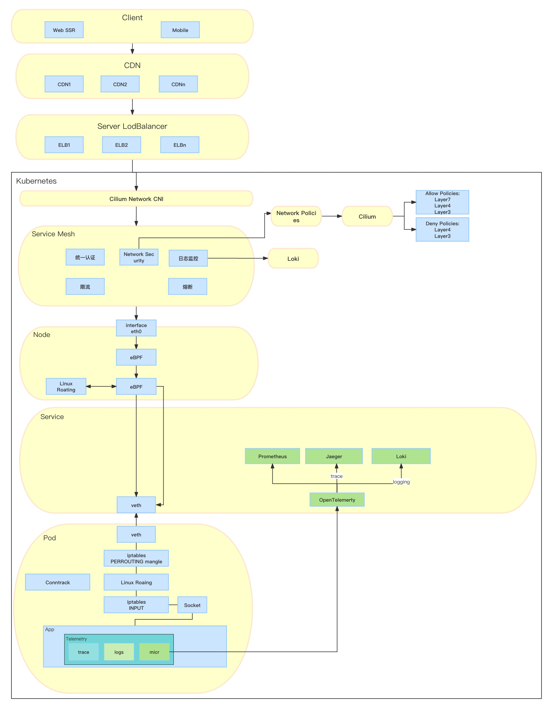

# kubernetes-deploy

## 分类

### Application Definition & Image Build
1. Helm

### Continuous Integration & Delivery
1. Argo(下一步计划)
2. Gitlab
3. Jenkins

###  Database
1. MongoDB
2. Redis
3. Postgres
4. TiKV(观望中)
5. TiDB(观望中)

### Streaming & Messaging
1. Kafka
2. 

### Scheduling & Orchestration
1. Kubernetes
2. 

### API Gateway
No

### Service Proxy
1. envoy
2. OpenELB
3. PureLB
4. Nginx

### Remote Procedure Call
1. gRPC
2. Kratos

### Service Mesh
1. Istio
2. Consul

### Coordination & Service Discovery
1. CoreDNS
2. etcd

### Cloud Native Storage
1. CSI
2. Minio

### Container Runtime
1. Containerd

### Cloud Native Network
1. flannel
2. cilium(实验中)
3. CNI

### Container Registry
1. Harbor

### Monitoring
1. Prometheus
2. Grafana

### Logging
1. Grafana Loki
2. fluentd(观望中)
 
### Tracing
1. Jaeger
2. OpenTelemetry

## 软件工程

